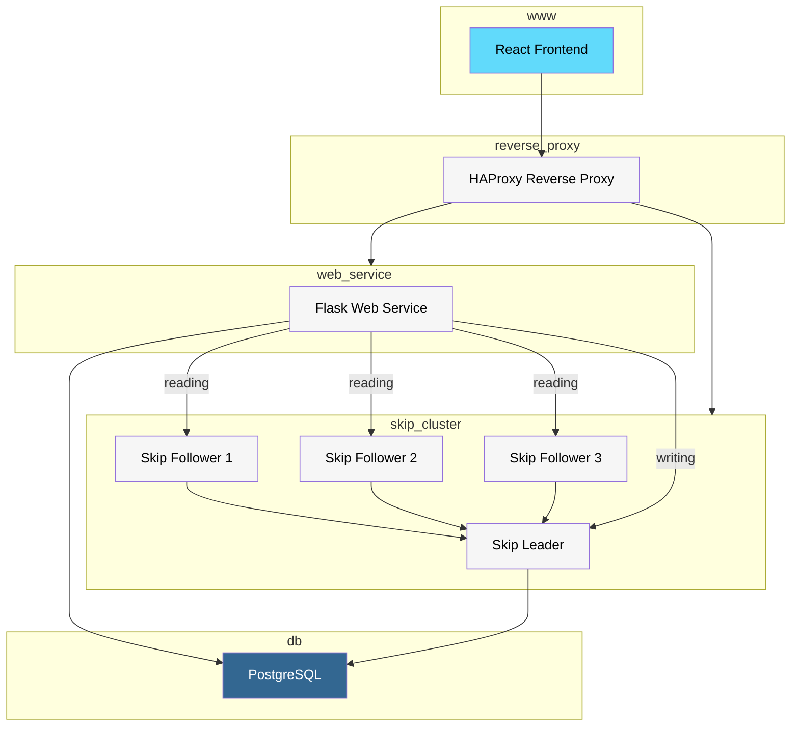
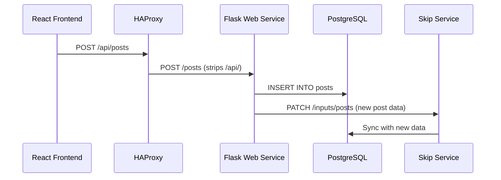
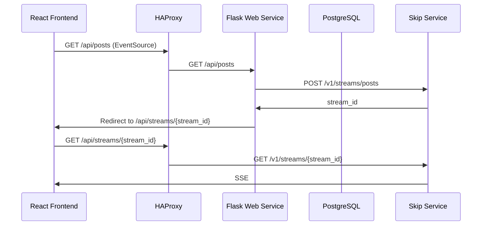

# Reactive HackerNews example

This example is made of a Skip reactive service (in `reactive_service/`), a
Flask web service (in `web_service/`), a React front-end (in `www/`), a HAProxy
reverse-proxy (in `reverse_proxy/`), and a PostgreSQL database (in `db/`).

We provide configurations to run it using either Docker Compose or Kubernetes.
The Docker Compose version is simpler and easier if you just want to get
started with as few dependencies as possible; the Kubernetes version may be
useful for users already using Kubernetes for other deployments.

## Docker Compose

To build and run the application using Docker Compose, first install and run
Docker on your system, then run:

```
$ docker compose up --build
```

In addition to the default configuration which runs a single Skip service, this
example can also run the Skip service in a distributed *leader-follower*
configuration, with one *leader* handling writes and talking to the Postgres DB,
and three *followers* which serve reactive streams to clients, sharing the load
of computing and maintaining resources in a round-robin fashion.

This distributed configuration requires only configuration changes, is
transparent to clients, and can be run with:
```
$ docker compose -f compose.distributed.yml up --build
```

## Kubernetes

To run the application in a local Kubernetes cluster, you'll need several other
prerequisites in addition to Docker.  Perform the following steps, which will
run and deploy the full application (in a distributed leader-follower
configuration) to a local Kubernetes cluster.

1. Install [`kubectl`](https://kubernetes.io/docs/tasks/tools/#kubectl)
   (configuration tool to talk to a running cluster),
   [`helm`](https://helm.sh/docs/intro/install/) (Kubernetes package manager)
   and [`minikube`](https://minikube.sigs.k8s.io/docs/start) (local Kubernetes
   cluster), and initialize a cluster with `minikube start`.

2. Enable the local Docker `registry` addon for `minikube` to use
   locally-built images : `minkube addons enable registry` and expose its port
   5000: `docker run --rm -it --network=host alpine ash -c "apk add socat &&
   socat TCP-LISTEN:5000,reuseaddr,fork TCP:$(minikube ip):5000" &`

3. Build docker images for each component of this example, then tag and publish
   each one to the `minikube` registry:
```
docker compose -f kubernetes/compose.distributed.yml build
for image in web-service reactive-service www db ; do
  docker tag reactive-hackernews/$image localhost:5000/$image;
  docker push localhost:5000/$image;
done
```

4. Deploy these images to your local Kubernetes cluster: `kubectl apply -f 'kubernetes/*.yaml'`

5. Configure and run HAProxy as a Kubernetes ingress controller, mediating
   external traffic ("ingress") and distributing it to the relevant Kubernetes
   service(s).
```
kubectl create configmap haproxy-auxiliary-configmap --from-file kubernetes/haproxy-aux.cfg
helm install haproxy haproxytech/kubernetes-ingress -f reverse_proxy/kubernetes.yaml
```

6. `minikube service haproxy-kubernetes-ingress` to open a tunnel to the
   now-running ingress service, and point your browser at the output host/port
   to see the service up and running!

### Overall System Design with optional leader/followers



### System Design Details

The HackerNews example implements a modern, reactive architecture with the following key components:

1. **Frontend Layer (www)**
   - React-based single-page application
   - Communicates with backend services through `reverse_proxy`
   - Implements real-time updates using `EventSource` for posts and session data
   - Handles user interactions like posting, upvoting, and authentication

2. **Reverse Proxy Layer (reverse_proxy)**
   - HAProxy serves as the entry point for all client requests
   - Routes traffic between frontend and backend services
   - Provides load balancing in distributed mode

3. **Web Service Layer (web_service)**
   - Flask-based REST API service
   - Handles traditional CRUD operations
   - Manages user authentication and session handling (stateful)
   - In distributed mode, separates read and write operations:
     - Write operations go to the Skip Leader
     - Read operations are distributed across Skip Followers

4. **Database Layer (db)**
   - PostgreSQL database for persistent storage
   - Stores all application data including posts, users, and votes
   - Serves as the single source of truth for the system

5. **Reactive Layer (skip_cluster)**
   - Implements the Skip reactive programming model
   - Two operational modes:
     
     a) **Single Service Mode**
     - Single Skip service handles all reactive operations
     - Direct connection to PostgreSQL
     - Manages both read and write operations
     
     b) **Distributed Mode (skip_cluster)**
     - Leader-Follower architecture:
       - **Leader**: Handles all write operations and database synchronization
       - **Followers**: Three instances sharing read operations in round-robin
     - Followers maintain consistency by syncing with the Leader
     - Provides horizontal scalability for read operations
     - Transparent to clients (no client-side changes needed)

6. **Key Architectural Features**
   - Real-time updates through EventSource/Server-Sent Events
   - Clear separation of concerns between services
   - Scalable architecture through distributed Skip services
   - Configuration-based switching between single and distributed modes
   - Health-check based service dependencies
   - Persistent storage with PostgreSQL
   - Load-balanced read operations in distributed mode

7. **Data Flow**
   - Client requests enter through HAProxy
   - Write operations (POST/PUT/DELETE) route to Flask service or Skip Leader
   - Read operations (GET) can be served by Flask or Skip Followers
   - Real-time updates flow from Skip services to clients via EventSource
   - Database serves as the ultimate source of truth

This architecture demonstrates a modern approach to building reactive web applications, combining traditional REST APIs with real-time capabilities, while providing flexibility in deployment through both single-service and distributed configurations.


### Dataflow when posting



### Dataflow for continuous reading


