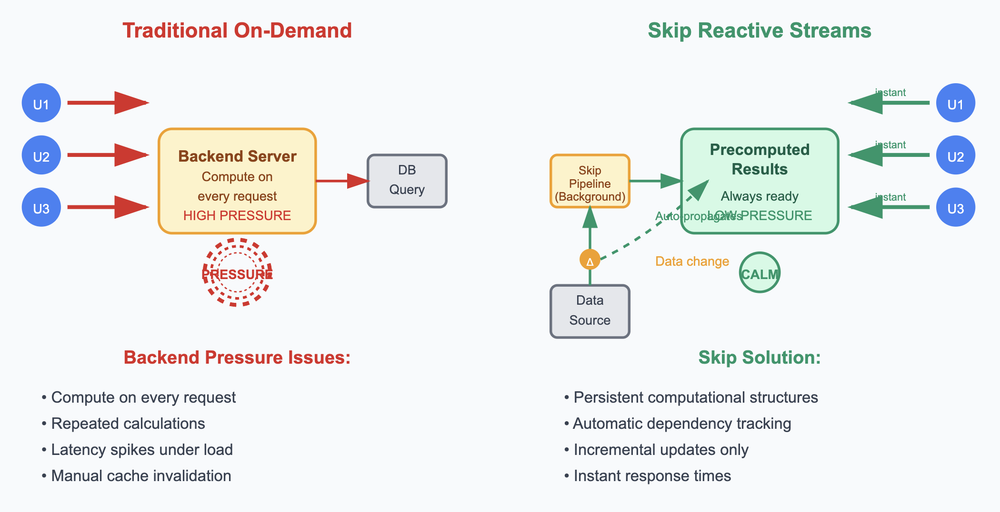

Backend systems face constant pressure from multiple directions: user requests demanding instant responses, databases struggling under query loads, and servers managing finite computational resources. This backend pressure—the cumulative stress of handling concurrent requests while maintaining performance and resource constraints—manifests in bottlenecks, latency spikes, and system instability. Traditional approaches often treat these pressures as isolated problems—adding a cache here, optimizing a query there—resulting in complex patches that fix symptoms but ignore deeper architectural issues.

The conventional solution? Event-driven architectures and streaming systems. But here's the problem: these approaches force developers to manually create and manage streams, handle async complexity, deal with event schemas, and debug distributed streaming pipelines. You end up spending more time on streaming infrastructure than on your actual business logic.

Think of a financial portfolio app: instead of calculating portfolio performance each time a user loads their dashboard, the server maintains continuous streams where position changes flow through pricing calculations, which flow through performance metrics, which flow through sector aggregations. Or an e-commerce site where product price changes automatically update product views, category aggregations, search indices, and recommendation scores in real-time. Rather than computing results on demand, reactive systems keep computational pipelines running continuously, so the answers are always up-to-date and ready for immediate use—reducing latency and spreading load over time instead of spiking under demand.

{/* trunctate */}

## Precomputed Reactive Structures

A reactive approach maintains continuous streams: position changes flow through pricing calculations, which flow through performance metrics, which flow through sector aggregations. The portfolio view stays current automatically, and user requests return instantly regardless of portfolio complexity.

And here's the key insight that changes everything: we should be able to treat complex computations as persistent data structures rather than transient operations. These structures exist in memory, stay synchronized with source data, and serve requests without additional computation. This is the fundamental principle behind Skip's approach, which we'll explore in detail later.

## Cache Invalidation as Dependency Management

Traditional caching introduces the notorious cache invalidation problem: when source data changes, systems must remember to invalidate all dependent cached values. This leads to either stale data or overly aggressive invalidation that negates caching benefits.

Reactive systems eliminate manual cache invalidation by treating cached values as materialized views with explicit dependencies. When source data changes, the system automatically pushes updates through the dependency graph to wherever they are needed—whether that's materialized views, API endpoints, or system edges. Cache invalidation becomes dependency propagation.

For example, when a product price changes in an e-commerce system, the reactive pipeline automatically updates product views, category aggregations, search indices, and recommendation scores. Hand-written reactive systems typically handle simple event propagation but require a lot of extra code written by developers in the backend to manage complex stateful views and aggregations. Skip enables this ideal: the developer declares dependencies once; the system maintains consistency thereafter through automatic dependency management of complex computational states.

How can Skip enable this ideal? Three words for you: granular incremental updates.

## Granular Incremental Updates

Skip reactive backends can perform granular, incremental updates rather than full recalculation when source data changes. If one product among thousands changes price, only the affected portions of aggregated views require updates. Category totals recalculate only for the affected category. Search indices update only relevant entries.

This granularity reduces computational overhead and memory churn. Systems can maintain complex materialized views that would be prohibitively expensive to recalculate entirely on each change.

Granular updates also improve system responsiveness. Instead of blocking while recalculating entire datasets, systems can process changes incrementally and continue serving requests throughout the update process.

I know what you're thinking: "This sounds great, but what's the catch?" Well, like most things in engineering, there are trade-offs to consider.

## Memory-Computation Trade-offs

We make a trade-off: memory for computation time and request latency. Maintaining precomputed structures requires more memory than computing results on demand. However, memory costs have decreased significantly relative to computation costs and user experience requirements.

The trade-off becomes particularly favorable for read-heavy workloads where the same complex computations serve multiple requests. Computing once and serving many times provides better resource utilization than recomputing identical results repeatedly.
So we've covered the theory and the benefits, but what about the practical side? Well, implementing this isn't without its challenges.

## Implementation Considerations

Implementing reactive backends requires careful consideration of data flow patterns and dependency graphs. Systems must handle backpressure when computation cannot keep pace with data changes. They must also manage memory usage as materialized views grow with data volume.

Monitoring remains important for reactive systems, though the metrics of interest shift from traditional patterns. Traditional metrics like request latency remain relevant, but reactive systems require additional visibility into stream processing rates, backpressure events, and materialized view sizes to understand system health.

## Skip's Approach to Reactive Systems

What if there was a completely different way to tackle this complexity? What if we could get all the benefits of reactive systems without having to build or manage the streams ourselves? This is where Skip comes from.

Skip is a reactive framework that automatically creates and manages streams for you based on declarative computations. You write code as if time is frozen—defining what your outputs should look like based on your inputs at a single point in time—and Skip automatically turns this into live reactive streams that update clients in real-time. No manual stream wiring, no event handling complexity, no dependency tracking. Just declarative logic that automatically becomes reactive infrastructure.

Think of it this way: instead of programming reactive streams directly, you write functions that describe relationships between data. Skip automatically generates the optimal reactive streams to keep everything synchronized and delivers updates to clients seamlessly.

This approach fundamentally changes how we think about backend pressure because you're no longer computing results on demand or managing complex event flows. Skip handles the reactive infrastructure while you focus on the business logic relationships between your data.

## Wrap up

Reactive programming addresses backend pressure by shifting computation from request time to background processing. This approach enables instant response times, automatic cache consistency, and granular updates that scale with system complexity.
The fundamental insight is treating complex computations as persistent, automatically maintained data structures rather than transient operations. This perspective changes how systems handle scaling, caching, and data consistency, often simplifying architecture while improving performance.

If you're dealing with read-heavy workloads where the same complex computations serve multiple requests, reactive approaches offer a compelling alternative to traditional request-response patterns. Start by identifying your most computationally expensive read operations—those are prime candidates for reactive transformation. Look for scenarios where you're repeatedly calculating the same results, dealing with complex cache invalidation logic, or struggling with response times under load.
The challenge has always been the complexity of building and managing these reactive systems manually. Skip changes this by automatically handling the stream creation, dependency tracking, and incremental updates that make reactive backends practical. Instead of spending weeks building reactive infrastructure, you can focus on declaring the relationships between your data and let Skip generate the optimal streaming architecture.

The reactive paradigm isn't a silver bullet, but for systems facing mounting backend pressure from concurrent requests and complex computations, Skip provides a viable path toward managing computational load without sacrificing response times or data consistency. As your system complexity grows, the benefits of automatic dependency management and incremental updates become increasingly valuable.
In our next post, we'll dive deep into load testing Skip-powered systems and share concrete performance data that demonstrates these benefits in practice. We'll explore how Skip's reactive architecture behaves under various load patterns and what metrics matter most when evaluating performance.

