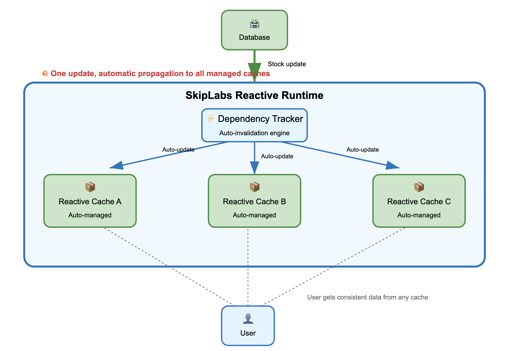

Phil Karlton famously said there are only two hard things in computer science: cache invalidation and naming things. While naming things might be subjective, cache invalidation remains one of the most persistent and complex challenges in modern software architecture. As applications scale and user expectations for real-time data increase, the traditional approaches to cache management are showing their limitations.

Cache invalidation sits at the heart of the performance versus consistency trade-off. Get it wrong, and users see stale data that can lead to poor user experiences, incorrect business decisions, or even security vulnerabilities. Get it right, but implement it inefficiently, and you lose the performance benefits that caching was supposed to provide in the first place. This fundamental tension has driven decades of innovation in caching strategies, from simple time-based expiration to complex dependency tracking systems.

{/* truncate */}

## The Infrastructure Caching Challenge

Modern applications rely heavily on caching at multiple layers of the infrastructure stack. From CDN edge caches serving static assets to application-level caches storing database query results, each layer introduces its own invalidation complexities. The challenge becomes exponentially more difficult when these caches are distributed across multiple servers, data centers, or even continents.

Traditional cache invalidation strategies fall into several categories, each with significant trade-offs. Time-based expiration (TTL) is simple to implement but leads to either stale data or unnecessary cache misses. Manual invalidation provides precision but requires developers to correctly identify all cache dependencies, which becomes nearly impossible as applications grow in complexity. Event-driven invalidation offers better accuracy but introduces coupling between business logic and caching infrastructure.

The problem is further complicated by the reality of distributed systems. Network partitions, clock skew, and eventual consistency models mean that even well-designed invalidation strategies can fail. A cache invalidation message might be delayed, lost, or arrive out of order, leaving some cache nodes serving stale data while others have been properly updated. These edge cases are notoriously difficult to test and debug, often surfacing only under production load.

Database-backed applications face additional challenges when multiple cache layers exist between the data store and the user. A single database update might need to invalidate entries in Redis, Memcached, application memory caches, and CDN caches. Coordinating this invalidation across heterogeneous systems while maintaining performance and consistency guarantees is a significant engineering challenge that most teams struggle with.

## Introducing SkipLabs: A Reactive Approach to Cache Invalidation

SkipLabs.io represents a fundamentally different approach to solving the cache invalidation problem through reactive backend architecture. Rather than treating caching as a separate concern that must be manually coordinated with data updates, SkipLabs builds reactivity into the core of the data processing pipeline. This means that when underlying data changes, all dependent computations and cached results are automatically updated in a cascading fashion.

The reactive model employed by SkipLabs draws inspiration from functional reactive programming and incremental computation research. When a piece of data changes, the system automatically identifies all computations that depend on that data and updates them incrementally. This eliminates the need for manual cache invalidation because the "cache" is always kept in sync with the underlying data through the reactive dependency graph.

SkipLabs implements this through a sophisticated runtime that tracks fine-grained dependencies between data and computations. Unlike traditional caching systems where invalidation is an external concern, the SkipLabs runtime makes invalidation an intrinsic property of the computation model. When data changes, the runtime can precisely identify which cached computations need to be updated and can often perform these updates incrementally rather than recomputing from scratch.

The platform is designed to handle complex scenarios that traditional caching systems struggle with, such as joins across multiple data sources, aggregations over large datasets, and deeply nested dependency chains. By modeling these relationships explicitly in the reactive runtime, SkipLabs can provide strong consistency guarantees while maintaining the performance benefits of caching.

## Pros and Cons of the Reactive Approach

The reactive approach to cache invalidation offers several compelling advantages. The elimination of manual invalidation logic significantly reduces the cognitive load on developers, who no longer need to track complex dependency relationships or remember to invalidate specific cache keys when data changes. This leads to more maintainable codebases and fewer bugs related to stale data.

Performance characteristics can be superior to traditional caching in many scenarios. Because the system understands the dependency graph, it can perform minimal incremental updates rather than invalidating entire cache regions. For applications with complex data relationships, this can result in much more efficient cache utilization and faster response times to data changes.

The consistency guarantees provided by reactive systems are typically stronger than those offered by eventually consistent caching systems. Because updates propagate automatically through the dependency graph, there's less risk of serving stale data or having inconsistent views across different parts of the application.

However, the reactive approach also comes with significant trade-offs. The complexity is shifted from application code to the runtime system, which can make debugging and performance tuning more challenging. Developers need to understand the reactive model and how their code will be executed within that model, which represents a significant learning curve.

Resource overhead can be substantial, particularly for applications with large or frequently changing datasets. Maintaining the dependency graph and performing incremental updates requires additional memory and CPU resources compared to simpler caching strategies. For applications with straightforward caching needs, this overhead may not be justified.

The reactive model also imposes constraints on how applications can be structured and how data can be accessed. Not all existing codebases can be easily adapted to work within a reactive framework, potentially requiring significant architectural changes to realize the benefits.

## Wrap-up

Cache invalidation remains one of the most challenging problems in distributed systems, with traditional approaches often forcing difficult trade-offs between performance, consistency, and complexity. The reactive approach pioneered by platforms like SkipLabs offers a promising alternative that could fundamentally change how we think about caching and data consistency.

While reactive systems aren't a silver bullet and come with their own complexities and trade-offs, they represent an important evolution in our approach to building data-intensive applications. As the technology matures and developer tooling improves, reactive backends may become a viable option for a broader range of applications.

The key is understanding that cache invalidation isn't just a technical problem to be solved, but a fundamental design challenge that shapes how we architect our systems. Whether through traditional invalidation strategies or reactive approaches like SkipLabs, the goal remains the same: providing users with fast, consistent access to data while maintaining system scalability and developer productivity. The reactive approach offers a new tool in our arsenal for tackling this enduring challenge in computer science.