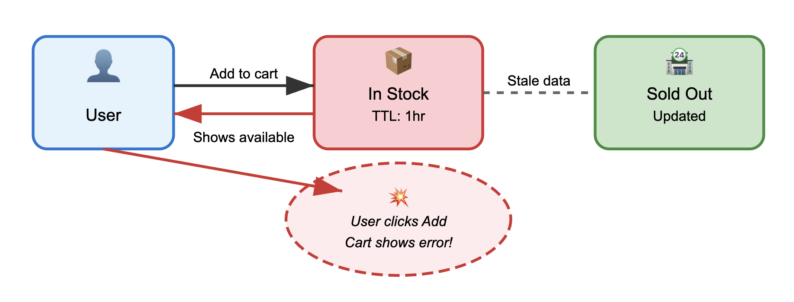

Phil Karlton famously said *there are only two hard things in computer science: cache invalidation and naming things*. While naming things may be subjective, [cache invalidation](https://en.wikipedia.org/wiki/Cache_invalidation) is a problem that only gets harder as our systems grow more complex. As applications scale and users expect real-time data everywhere, traditional approaches to cache management crack under pressure.

Here's the thing about cache invalidation: it sits right at the center of the classic performance versus consistency trade-off. Mess it up, and your users are stuck looking at stale data. Maybe they see yesterday's stock prices, or worse, they're making business decisions based on outdated metrics. But nail the consistency part while implementing it poorly, and you've just thrown away all the performance benefits that made you add caching in the first place. This fundamental tension has been driving innovation in caching strategies for decades, from simple [Time-to-live (TTL)](https://en.wikipedia.org/wiki/Time_to_live) expiration to increasingly complex dependency tracking systems.

{/* truncate */}

## The Infrastructure Caching Challenge

Modern applications cache everywhere, from [CPU L1/L2 caches](https://en.wikipedia.org/wiki/CPU_cache) to [CDN edge caches](https://en.wikipedia.org/wiki/Content_delivery_network) to application-level query caches, and each layer brings its own invalidation headaches that get exponentially worse across distributed systems. You've probably dealt with the classic cache invalidation strategies, and you know they all suck in their own special ways: TTL forces you to choose between stale data and cache misses, manual invalidation becomes impossible to maintain as dependencies grow, and event-driven invalidation couples your business logic to caching infrastructure.

Then there's the distributed systems reality check. [Network partitions](https://en.wikipedia.org/wiki/Network_partition) happen, clocks drift, and eventual consistency models mean that even your best-designed invalidation strategies can fail spectacularly. Your invalidation message gets delayed, lost, or arrives out of order, and suddenly half your cache nodes are serving stale data while the other half got the memo. These edge cases are the worst: they're nearly impossible to test properly and usually only surface when you're already under production load.

If you're running database-backed applications, you're dealing with multiple cache layers between your data store and your users. A single database update might need to invalidate entries in [Redis](https://en.wikipedia.org/wiki/Redis), [Memcached](https://en.wikipedia.org/wiki/Memcached), your application's memory cache, and your CDN caches. Coordinating this invalidation across all these different systems while maintaining performance and consistency? That's the kind of engineering challenge that makes you question your career choices.

Ok, I may be a little dramatic here, but now that we agree on the problem we're talking about...

## SkipLabs: A Reactive Approach to Cache Invalidation

At [SkipLabs](https://skiplabs.io/), we take a different approach to the cache invalidation problem through reactive backend architecture. Instead of treating caching as a separate concern requiring manual coordination, SkipLabs builds reactivity right into the core of your data processing pipeline. When your underlying data changes, all dependent computations and cached results automatically update in a cascading fashion.

The reactive model that SkipLabs uses draws from functional reactive programming and incremental computation research. When data changes, the system automatically figures out which computations depend on that data and updates them incrementally. You don't need manual cache invalidation because the *cache* is always in sync with the underlying data through the reactive dependency graph.

SkipLabs pulls this off through a sophisticated runtime that tracks fine-grained dependencies between data and computations. Unlike traditional caching systems where invalidation is something you bolt on afterward, the SkipLabs runtime makes invalidation an intrinsic part of how computation works. When data changes, the runtime precisely identifies which cached computations are affected and updates them incrementally.

The platform handles the complex scenarios that make traditional caching systems cry: joins across multiple data sources, aggregations over massive datasets, deeply nested dependency chains. By modeling these relationships explicitly, SkipLabs can provide strong consistency guarantees while keeping the performance benefits of caching.

## Pros and Cons of the Reactive Approach

The reactive approach has some compelling advantages. First, you can finally stop writing manual invalidation logic. No more tracking complex dependency relationships or trying to remember which cache keys to invalidate when data changes. Your codebase becomes more maintainable, and you'll have fewer bugs related to stale data keeping you up at night.

Performance can be significantly better than traditional caching in many scenarios. Because the system understands your dependency graph, it can perform minimal incremental updates rather than nuking entire cache regions. For applications with complex data relationships, this means much more efficient cache utilization and faster response times when data changes.

The consistency guarantees are typically stronger than what you get with eventually consistent caching systems. Updates propagate automatically through the dependency graph, so there's less risk of serving stale data or having different parts of your application showing inconsistent views.

But let's be real about the trade-offs. The complexity doesn't disappear, it just moves from your application code into the runtime system. This can make debugging and performance tuning more challenging when things go wrong. You need to understand the reactive model and how your code will execute within it, which represents a significant learning curve for you and your team.

Converting existing code to the Skip runtime without properly structuring and decomposing its dependency structure can incur more resource overhead than it saves through incrementality. The benefits of reactive systems shine when computations are well-structured for incremental updates, but poorly designed dependency graphs can actually hurt performance compared to simpler caching strategies.

The reactive model also puts constraints on how you can structure your applications and access data. Not every existing codebase can be easily adapted to work within a reactive framework, you might need significant architectural changes to realize the benefits. To me, this is the hardest problem to solve.

## Wrap-up

Cache invalidation continues to be one of the most challenging problems in software engineering, with traditional approaches forcing difficult trade-offs between performance, consistency, and complexity. The reactive approach that platforms like SkipLabs are pioneering offers a promising alternative that could fundamentally change how we think about caching and data consistency.

Reactive systems aren't a silver bullet, they come with their own complexities and trade-offs. But they represent an important evolution in how we build data-intensive applications. As the technology matures and developer tooling improves, reactive backends may become viable for a much broader range of applications.

The key insight is that cache invalidation isn't just a technical problem to solve, it's a fundamental design challenge that shapes how we architect our systems. Whether you're using traditional invalidation strategies or exploring reactive approaches like SkipLabs, the goal remains the same: giving users fast, consistent access to data while maintaining system scalability and developer sanity. The reactive approach gives us a new tool for tackling this enduring challenge in computer science.

## What's Next?
I'd love to hear what aspects of cache invalidation and reactive systems you'd like me to dive deeper into. Are you interested in:

- Detailed performance results for a reactive approach?
- Deep technical implementation details of how SkipLabs tracks dependencies?
- Real-world case studies of teams migrating from traditional caching to reactive systems?
- Practical migration strategies for existing codebases?
- Other distributed systems challenges that reactive architectures could solve?

Drop me a line and let me know what you'd find most valuable, your feedback helps shape what I write about next.