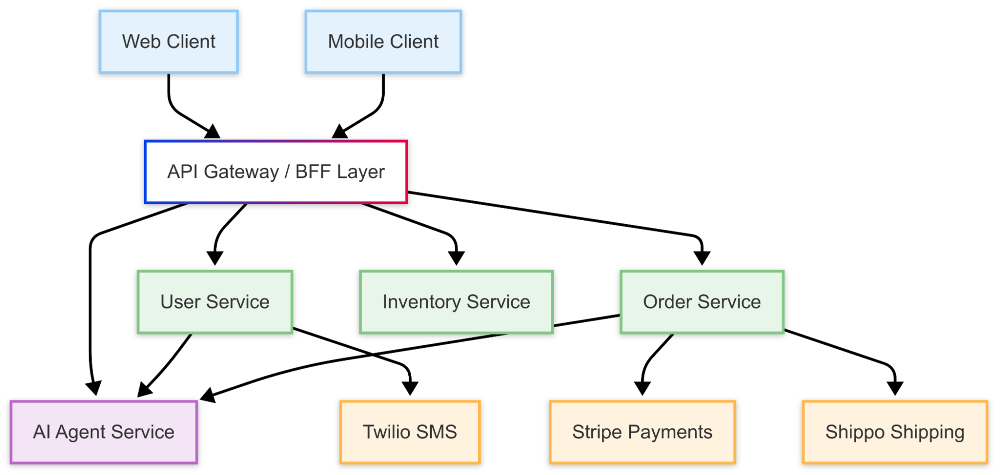

## Event-Hidden Architectures

### How did we get here?

One of the most powerful and consistent trends in software for the past decade has been the move from single stack to cloud native applications.  Cloud native applications are inherently distributed and have become popular as developers are drawn to the convenience of containers and platform-as-a-service infrastructure.

The API-ification of important subsystems means today hardly anyone would consider implementing their own payments, shipping, SMS, chat, billing or shopping cart functionality.  Instead they’ll lean on Stripe, Twilio, Shopify, Shippo, etc; accelerating time-to-value and further distributing the functions of the application.

In the last few years developers have moved quickly to incorporate more and diverse AI features into their applications, but AI models and application logic compute requirements are quite different from one another and therefore seldom run in the same stack, further distributing the application.

<!-- truncate -->

Some have called for a “back to basics” approach of a single stack or modular monolith, but given the list of external demands on modern application development, distributed is unlikely to go away.  Instead it’s becoming a more common approach for application architectures, not less, especially for “successful” applications that need to modularize to support more customers, users and features.

### 10 years of bad advice

One can sympathize with the desire for a “back to basics” approach to cloud-native applications.  There are many “pros” to writing cloud-native, distributed applications but living with them has been miserable for developers and operators alike.  “Cloud native” is effectively synonymous with “distributed,” and “distributed” is another way to say a network is parked in the middle of the application.  This changes engineering and operations in many big and subtle ways.  The most common and questionable advice to tackle these challenges has been “event-driven.”

Events are the biggest reason why engineering teams try to postpone distributed or microservice architectures for as long as possible.  “Cloud native” and “microservices” have unwittingly become synonymous with “event-driven” and sullied their reputations in the process.

Events remain a useful technical mechanism to transmit state and data among application resources but they are a miserable experience for developers and operators alike.  Events:

- Put application state and data in dozens of queues that make the application prone to failures, race conditions and incorrect results
- Force developers to think and program asynchronously which is more complex and time consuming than synchronous code
- Require developers know more than just their portion of the code and application domain: they also need to understand how to work with queues, caches and event schemas
- Make applications difficult to troubleshoot as there is no one place to understand the state and data for an application

###  ~~Event-driven~~ vs event-hidden

The event-driven approach *was* necessary in 2020 but it isn’t any longer in 2025\.  Today’s modern abstractions ensure it’s unnecessary to make a faustian bargain between the flexibility & scale of distributed and the existential dread inspired by event-driven architectures.

There are three innovations that together allow us to engineer applications as event-driven but where developers and operators are fully abstracted away from the events themselves.

1. [React](https://react.dev/) paired with client state management frameworks like [Redux](https://redux.js.org/), [Xstate](https://xstate.js.org/) or [Zustand](https://zustand-demo.pmnd.rs/) create a simple, productive experience for frontend engineering.  Frontend engineers are able to implement simple, performant UI components that can support complex application behaviors while outsourcing state and DOM management to the framework.

2. Durable execution systems like [Temporal](https://temporal.io/), [Restate](https://restate.dev/) and [DBOS](https://www.dbos.dev/) ensure distributed backend application writes are always correct within and across services and network boundaries because each function call is durable by default.  All of the convenient guarantees of an ACID transaction are injected into the everyday programming experience.

3. Reactive frameworks for incremental computation like [Skip](https://github.com/SkipLabs/skip) make it simple to implement distributed application reads from multiple sources and latencies to disparate clients and views.  Developers can blend data from multiple REST and/or streaming sources but write their logic as simple map functions free from references to infrastructure or events.  Because the services are reactive, performance and correctness concerns like cache invalidations are outsourced to the framework.

All three technologies share many of the same design principles.  Each technology caters to a different area of the application (client changes, backend writes, backend reads) but they all:

- Provide a declarative developer experiences free from references to infrastructure
- Are event-driven “under the covers” but don’t leak these details to users
- Work asynchronously, supporting high levels of concurrency but still make the developer experience feel effectively synchronous
- Manage and in some cases enforce immutability of functions and/or data
- Handle application state as a first class concern
- Allow for modularity and incremental adoption \- they don’t enforce “one pure approach” on an entire application
- Can run locally or globally
- Are open source

Collectively, these frameworks provide a substantial upgrade to applications across developer experience, feature velocity, correctness, efficiency and operational reliability.  Software development returns to a simpler, low context model; developers do not need to learn the unique quirks of low level infrastructure or understand the overall application architecture just to build or enhance their part of the application.

### New powers

Burying events doesn’t just simplify engineering, it grants engineers with new powers in the process.

**Transparency**

Ironically, with event-hidden engineering, every behavior of the application is now more visible in an actionable way because events are held in lower layers of the stack that understand their semantics and context.

**State Handling**

Events are not the only thing that get hidden.  By extension state handling, state changes and their implications for correctness are also buried in this new model.  The new developer experience is just implementing as if forever at “init time.”  All the progressions to get from 1 init time state to a future init time state are handled by the platforms powering the event-hidden architecture.

**Replayability**

Lastly, event-hidden architectures nearly always enable replayability.  Keeping events and state in a separate, well abstracted place makes it possible to give developers and operations teams a general way to time travel through the application’s computation.

### Conclusion

In 2025 it turns out you can go home again: you can build feature-rich, scaled, distributed applications without having to interact with events, queues and the industry of patterns, frameworks and consultants that came with them.

Event-hidden will become the default web app architecture for the next 10 years.

