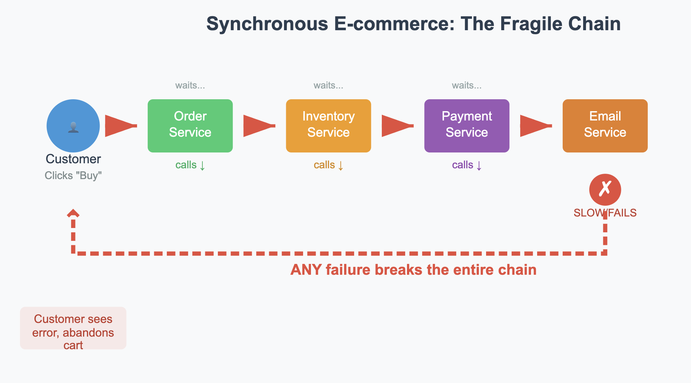
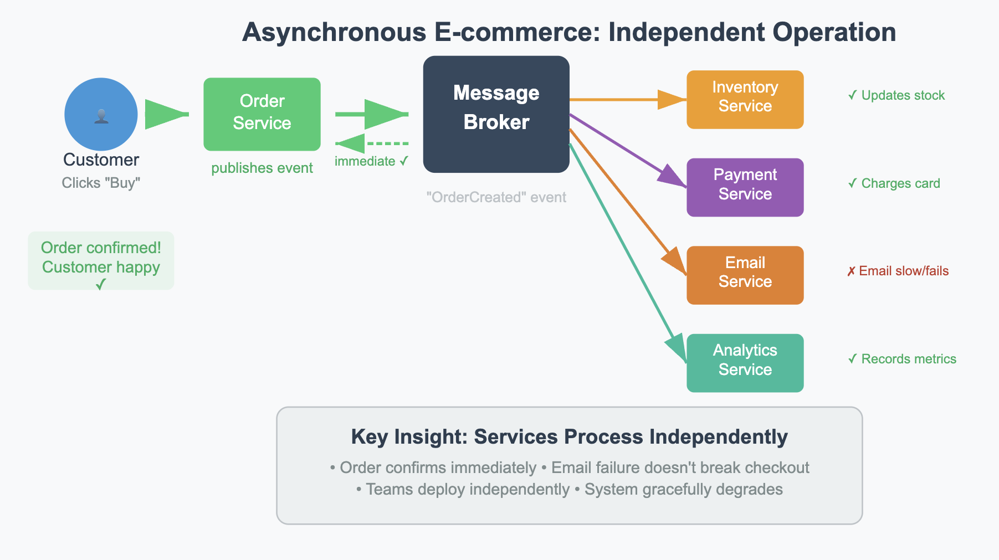

Picture this: you're a software engineer who just wants groceries.

In a **barter economy**, that's a significant challenge. The grocer won't trade until her inventory system is fixed. The database admin won't help until his kid gets dental care. The dentist won't see patients until her taxes are filed. The accountant won't do taxes until his computer is repaired. And the computer repair shop? They need custom diagnostic software built.

Your dinner depends on five people showing up in sequence, perfectly aligned. If the dentist's booked solid, you don't eat. If the accountant's in audit season, the chain collapses. Barter is **synchronous and tightly coupled**.

This sounds absurd because you're already familiar with asynchronous exchanges through money. Let me explain.

You write software today, get paid, and buy groceries tomorrow. The farmer sells produce on Tuesday, pays the roofer on Friday, and the lawyer gets her fee next month. Each exchange stands alone. Failures don't cascade. The medium of exchange **decouples everyone in time**.

But there's a crucial distinction in how this asynchronous magic happens.

When money changes hands as **cash**, it's like a **queue**: you hand over value, and it sits with the other person until they spend it. The system works asynchronously, but the "message" is literally in transit from one hand to another.

With **banking**, something more powerful emerges. The **bank** doesn't move money physically—it holds accounts, routes payments, and makes sure funds arrive reliably and durably even when people aren't present. That's exactly what a **message broker** does in software.

**The key point**: Asynchronous operation requires trusted intermediaries.

- **Barter** → RPC calls: synchronous, brittle, everyone waits
- **Cash** → Queues: asynchronous handoffs, but simple store-and-forward
- **Bank** → Message broker: asynchronous with durability, routing, and reliability guarantees

Money didn't just add convenience to economies—it fundamentally changed how economic actors could operate. They could work independently, at their own pace, without coordinating schedules. Message brokers do the same for distributed systems.

## The Asynchronous Mindset Shift

When teams adopt asynchronous thinking, several important things improve. Services stop waiting for each other. Teams stop coordinating deployment schedules. Systems become resilient to partial failures. But this shift requires infrastructure that makes async reliable—that's where message brokers come in.

A **message broker** is the trusted intermediary that makes asynchronous communication work at scale. Just like banks transformed economies by making money reliable across time and distance, message brokers transform software systems by making messages reliable across services and failures.

Popular brokers like [Apache Kafka](https://kafka.apache.org/), [RabbitMQ](https://www.rabbitmq.com/), [Apache Pulsar](https://pulsar.apache.org/), and cloud services like [AWS SQS](https://aws.amazon.com/sqs/) handle the complex job of making async messaging work reliably. But understanding why async matters comes first.

### The Async Reliability Challenge

Asynchronous systems face unique challenges that synchronous systems never encounter:

**Temporal decoupling** means producers and consumers operate at different rates and times. Your order service might generate 1000 events per second while your analytics service can only process 100. In synchronous systems, this would mean 900 dropped requests. With message brokers, those 900 extra messages wait their turn.

**Delivery guarantees** become critical when you can't verify receipt immediately:
- **At-most-once**: Fast but lossy—like shouting across a noisy room
- **At-least-once**: Reliable but may duplicate—like sending certified mail twice to be sure
- **Exactly-once**: Perfect but expensive—like having a notary witness every handoff

**Ordering semantics** get complex when messages flow asynchronously. Message brokers solve this through **partitioning**—ensuring messages about the same customer always arrive in order, while allowing parallel processing across different customers.

## Real-World Async Transformation

### Case Study: E-Commerce's Evolution from Sync to Async

Watch how an e-commerce platform's architecture evolves as it embraces asynchronous thinking:

**Phase 1: Synchronous Approach**

Every service waits for the next. Peak traffic kills response times. A slow email service breaks checkout. Teams can't deploy independently—one broken service cascades through the entire flow.

**Phase 2: Asynchronous Approach**

Now the order confirms immediately. Inventory updates happen in parallel with payment processing. Email delays don't break checkout. Analytics can replay all events to rebuild dashboards from scratch.

**The change affects both technical and organizational aspects.** Teams can now:
- Deploy services independently
- Process at their own optimal pace  
- Add new capabilities by subscribing to existing events
- Handle failures gracefully with retries and dead letter queues

## When Async Goes Wrong: Learning from Failure

Asynchronous systems introduce different failure modes than synchronous systems:

**Consumer Lag** is like economic inflation—when consumers can't keep up with producers, the system still functions but performance degrades. Message brokers provide monitoring and backpressure mechanisms to prevent system collapse.

**Message Poisoning** happens when malformed events break consumer processing. Just like banks have fraud detection, message brokers implement dead letter queues to quarantine problematic messages without stopping the entire system.

**Split-Brain Scenarios** occur during network partitions when different broker nodes think they're the leader. Like preventing double-spending in banking, brokers use consensus algorithms to maintain consistency.

**An advantage of async systems**: These failures are often contained and recoverable. In synchronous systems, any failure stops everything. In async systems, failures become opportunities for graceful degradation and recovery.

## Organizational Impact

An important impact of message brokers is how they can change team dynamics and organizational structure.

**Before message brokers**: Teams coordinate deployments, share databases, and negotiate API contracts. Changes require cross-team meetings and careful sequencing. Changes often require coordination across teams.

**After message brokers**: Teams publish events and consume what they need. New teams can tap into existing event streams without asking permission. Services evolve independently. Teams can often move faster when operating asynchronously.

This mirrors how money transformed human cooperation. Before money, every economic exchange required perfect coordination. After money, people could contribute value whenever they wanted and consume value whenever they needed it.

**Conway's Law applies here**: Organizations using message brokers often develop more autonomous teams building loosely coupled services. The architecture enables the organization, and the organization shapes the architecture.

## Async-First Architectures

Many successful distributed systems are adopting **async-first architectures** where events become the primary integration mechanism.

**Event sourcing** treats events as the source of truth, not just a side effect. Your message broker becomes your database, storing the complete history of what happened in your system.

**Stream processing** turns your event flows into real-time computation pipelines. Complex business logic emerges from simple event transformations, all happening asynchronously.

**Serverless integration** makes async even more powerful. Functions spin up automatically when events arrive, scale to zero when idle, and handle traffic spikes without pre-provisioned capacity.

Many modern systems are designed to operate asynchronously by default. Message brokers aren't just infrastructure—they're the enablers of this fundamental shift in how we build and organize software.

## The Bottom Line

Message brokers address a key challenge in distributed systems: **making asynchronous operation reliable at scale**. They're not just moving messages around—they enable a different approach to software architecture.

Just as money enabled modern economies by making asynchronous exchange reliable, message brokers enable modern software systems by making asynchronous communication reliable. The technical features matter, but the real revolution is organizational: teams that can operate independently while building cohesive systems.

The question isn't whether you need a message broker—it's whether you're ready to embrace asynchronous thinking. Moving back to synchronous patterns becomes less appealing once teams experience the benefits of async systems.

---

*How has embracing asynchronous patterns changed your team's development velocity? What organizational friction disappeared when you stopped requiring services to wait for each other?*