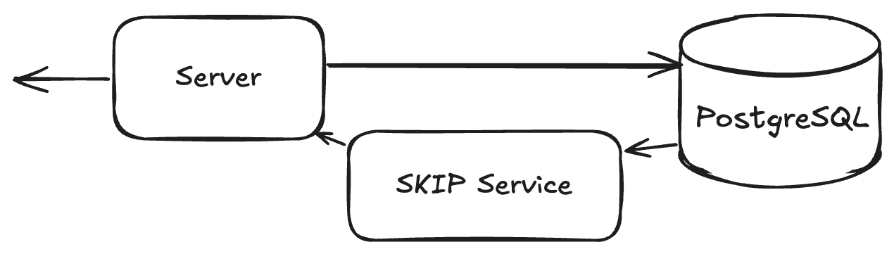

Hello Skippers. Today, we are going to plug a [PostgreSQL](https://www.postgresql.org/) service and our starting point is the following project on GitHub: [Skip Postgres Demo](https://github.com/SkipLabs/postrgre_and_skip_poc). We will demonstrate how to use SKIP's reactive data streaming with a PostgreSQL backend. This project implements a simple blog post system with real-time updates using SKIP's streaming capabilities.




Before we get too far ahead, two things…(1) what you need and (2) what you will learn: 

## What you need: 

- [Node.js](https://nodejs.org/en) (Latest LTS version recommended)
- [`pnpm`](https://pnpm.io/) package manager
- [Docker](https://www.docker.com/) (for PostgreSQL)
- (optional) a Json pretty printer in the terminal, I use [jq](https://jqlang.org/)

## What you will learn:

- Real-time post streaming using SKIP's reactive data system
- PostgreSQL integration for data persistence
- RESTful API endpoints for post management
- Support for streaming data access

## Okay..ready?….let's go!

We are starting from a REST server for the simplest blog post system and we are going to add real-time updates features to it.
Let's check out the project: 
```bash
git clone https://github.com/SkipLabs/postgre_and_skip_poc.git
cd postgre_and_skip_poc/
git checkout $(git rev-list --max-parents=0 main)
```

And yes, you are right we are not starting on HEAD of the main branch, but don't worry we'll get there in no time.


Run the `init_and_start_server.sh` script, it will start a PostgreSQL database in a Docker container and fill it in with some data. It will then install and build the whole project with pnpm to finally start it! 

```bash
./init_and_start_server.sh
```

The last lines should look something like:

```bash
🚀 Starting server...


> skip-postgres@1.0.0 start /your/path/skip-postgres
> node dist/index.js

Server running at http://localhost:3000

```

In a new terminal, we are going to check that the REST API is up:
First, let's display one of the articles: 

```bash
curl localhost:3000/posts/7 | jq
```

Note that here there's an easy shortcut -  I use [`jq`](https://jqlang.org/), 'will make life more convenient 

As you can see, the article is not published: 
```json
  "published_at": null,
  "created_at": "<some_date>",
  "updated_at": "<some_date>"
```
We are going to publish and unpublish it:

```bash
curl -X PATCH http://localhost:3000/posts/7/publish | jq
curl -X PATCH http://localhost:3000/posts/7/unpublish | jq
```

You should see the modification as results of the calls. 

A working REST API. 

And now here comes the fun part, let's make it a reactive API

## The SKIP Service

For that, we are going to need some SKIP packages: 

```bash
pnpm add -D @skipruntime/core @skipruntime/helpers @skipruntime/server
pnpm add @skip-adapter/postgres
```

A SKIP service has collections as inputs and mapper(s) to transform them into resources as outputs. 

In our case, in file [`skipservice.ts`](https://github.com/SkipLabs/postgre_and_skip_poc/blob/main/src/skipservice.ts) you will find: 

1. A type you want to be notified about: [`PostWithAuthor`](https://github.com/SkipLabs/postgre_and_skip_poc/blob/main/src/skipservice.ts#L16-L29) which contains information from two tables: Users and Posts (see [`schema.sql`](https://github.com/SkipLabs/postgre_and_skip_poc/blob/main/src/db/schema.sql)).

2. A mapper [`PostMapper`](https://github.com/SkipLabs/postgre_and_skip_poc/blob/main/src/skipservice.ts#L32-L65) which creates instances of this type from an `EagerCollection` (an `EagerCollection` is always kept up-to-date).

3. A resource [`PostResource`](https://github.com/SkipLabs/postgre_and_skip_poc/blob/main/src/skipservice.ts#L73-L85) which implements a function from a [`PostsResourceInputs`](https://github.com/SkipLabs/postgre_and_skip_poc/blob/main/src/skipservice.ts#L67-L69) to an `EagerCollection<number, PostWithAuthor>`

And it is when we instantiate our service that we plug it to the PostgreSQL, when we create the graph with [`createGraph`](https://github.com/SkipLabs/postgre_and_skip_poc/blob/main/src/skipservice.ts#L93-L109), we receive a context as input. This context provides a method `useExternalResource`. 

Remember that in SKIP, Resources are the outputs of your service that clients can subscribe to, while Collections are the inputs that feed data into your service. When you create a graph using `createGraph`, you define how these Collections are transformed into Resources. Once you've set up your graph and connected it to your external services (like PostgreSQL in our case), you just need a few lines of code in your server to expose these Resources to clients: 

```typescript
app.get(
 '/streams/posts/:uid',
 asyncHandler(async (req, res) => {
   const uid = Number(req.params.uid);
   const uuid = await serviceBroker.getStreamUUID('posts', uid);
   res.redirect(301, `${SKIP_READ_URL}/v1/streams/${uuid}`);
 })
);


app.get(
 '/streams/posts',
 asyncHandler(async (req, res) => {
   const uuid = await serviceBroker.getStreamUUID('posts');
   res.redirect(301, `${SKIP_READ_URL}/v1/streams/${uuid}`);
 })
);
```

You can find these lines in [`src/index.ts#L65-L80`](https://github.com/SkipLabs/postgre_and_skip_poc/blob/main/src/index.ts#L65-L80)

We are adding two endpoints:
- `/stream/posts/:uid` which is a stream of changes for a given post of id uid
- `/stream/posts` which is a stream of changes for the entire posts table

Let's play with it, in three terminals: 

### Terminal 1: Start the Server
```bash
./init_and_start_server.sh
```

Server and services are ready when you see: 
```bash
Skip control service listening on port 8081
Skip streaming service listening on port 8080
Server running at http://localhost:3000
```

### Terminal 2: Subscribe to Post Updates
```bash
curl -LN http://localhost:3000/streams/posts/7 | \
  while read -r line; do
    echo "$line" | grep '^data:' | sed 's/^data: //' | jq .
  done
```
> 💡 **Note**: The shell command above includes some formatting magic to make the output readable. It filters for data lines and pretty-prints the JSON using `jq`.

### Terminal 3: Modify the Post
```bash
curl -X PATCH http://localhost:3000/posts/7/publish | jq
curl -X PATCH http://localhost:3000/posts/7/unpublish | jq
```

Watch Terminal 2 while you run these commands in Terminal 3 - you'll see the real-time updates!

## Wrap-up

In our [previous blog post](https://skiplabs.io/blog/reactive_social_network_service_poc), we have walked you through how to create a skip SKIP service for a reactive social network, with code! Check it out ! [Reactive Social Network Service (Proof of Concept)](https://github.com/SkipLabs/reactive_social_network_service_poc). 

Now we have learned how to plug a PostgreSQL service using SKIP! 

## What's Next?

For the next SKIP article, what should I tackle first? You tell me!
- Scaling your SKIP service horizontally?
- Integrating with frontend frameworks like React?
- Managing authorization and privacy per user?
- What else would be most useful to you NOW? 

