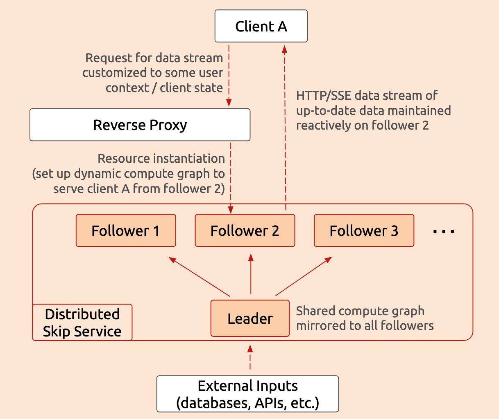

Skip makes it fast and easy to build reactive services which efficiently update
their outputs in response to input changes, powering real-time features and
saving resources by avoiding unnecessary recomputations.

The technical foundation that makes this possible is Skip's hyper-efficient
reactive computation graph, which is written in the Skip programming language,
runs natively, and takes great pains to efficiently represent and manipulate
the data underlying your reactive system.

However, that still requires memory, compute, and other resources -- so what do
you do when traffic spikes or grows beyond the capacity of even a powerful
single machine? Scale out and distribute your reactive service across more
machines, of course!

<!--truncate-->

We've recently built out some capabilities to make this easy, using a
distributed leader/follower architecture to dramatically increase the number of
concurrent resource instances that a Skip service can support.

## Leader/Follower architecture

A single Skip service consists of:

    * a **shared computation graph** representing the portion of that service's
	computations that is common among all of its clients: some data structures,
	aggregations, partially-computed results, or the like that are always
	maintained up-to-date regardless of client requests, and

    * one or more **resources** which can be instantiated by clients, dynamically
	extending the computation graph as needed to produce data streams customized
	by user-specific context or request parameters.

In practice, the work of maintaining the shared computation graph should not
massively increase under spiking load, but the work of maintaining resource
instances and serving their data streams _will_ increase in proportion to the
number of concurrent clients.

This dynamic affords an opportunity for **horizontal scaling**: we can maintain the
shared computation graph just once on a
[_leader_](https://skiplabs.io/docs/api/helpers/functions/asLeader) and mirror
it to each of any number of
[_followers_](https://skiplabs.io/docs/api/helpers/functions/asFollower),
among which resource instances are evenly distributed, as illustrated in the
following diagram:



This diagram shows the structure of a distributed Skip service and the data flow
for a single client request. When client A requests a live data stream, a
reverse proxy forwards that to an available follower, selecting follower 2 in
this example. That follower then sets up a reactive compute graph to maintain
the requested data, incorporating user context and query parameters from client
A as well as any shared inputs from the leader.

This design allows to instantiate many more resources for many more clients than
a single Skip service could handle alone, while maintaining the clean/simple
semantics and low latency of a single-service deployment.

To see this in action, you can pull our example, run it locally, and navigate to
`localhost` in your browser:

```bash
npx create-skip-service hackernews --example hackernews --verbose
docker compose -f hackernews/compose.distributed.yml up --build
```

To see more options or run the application in alternative configurations,
consult the `README.md`
[online](https://github.com/SkipLabs/skip/tree/main/examples/hackernews/README.md)
or in the `hackernews` directory created by `create-skip-service`.

## Kubernetes

Running a distributed reactive service is a great way to handle larger amounts
of traffic and/or more complex reactive computations, but what's really
important is to be able to easily scale your reactive system up and down when
your product goes viral, traffic spikes, and your pager goes off in the middle
of the night.

We've recently built out some Kubernetes
[configuration](https://github.com/SkipLabs/skip/tree/main/examples/hackernews/kubernetes/distributed_skip)
to make this as easy as running `kubectl scale --replicas=$X ...` (or the
GUI/dashboard equivalent if you prefer or are running on a hosted platform)
without breaking any clients or requiring any changes in your reactive service
or other backend components.

:::note

Try it yourself! Run the hackernews example linked above using its Kubernetes
configuration, then try running `kubectl scale --replicas=$REPLICAS statefulset
rhn-skip` with varying number of `REPLICAS` (at least 2, for one leader and one
follower) and see your Skip service scale up and down without downtime.

:::


The core idea is simple: your reactive Skip service is a Kubernetes
[StatefulSet](https://kubernetes.io/docs/concepts/workloads/controllers/statefulset/),
giving each pod a stable and unique network identity.  When a new pod is added
(either at startup or when scaling up), it registers itself with the cluster's
ingress load balancer.

When a resource is instantiated, the resulting data stream's identifier encodes
the follower hosting the stream, allowing the load balancer to route external
traffic to the proper Skip instance.  When traffic subsides and the deployment
scales down, the pod is taken out of rotation by the load balancer, until a
subsequent scale-up brings it back into use.

## Wrap-up

Everyone's infrastructure and application are different, so let us know if there
are other frameworks or tools you'd like to see supported or used in our
examples and demos!

We're also happy to help you scale out your reactive service using Skip, either
by adapting these tools to your environment or advising on your setup.  Reach
out and show us what you're building, or come join the
[Discord](https://discord.gg/2nzP2PZj)!
