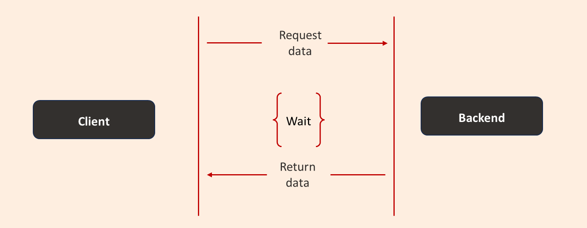
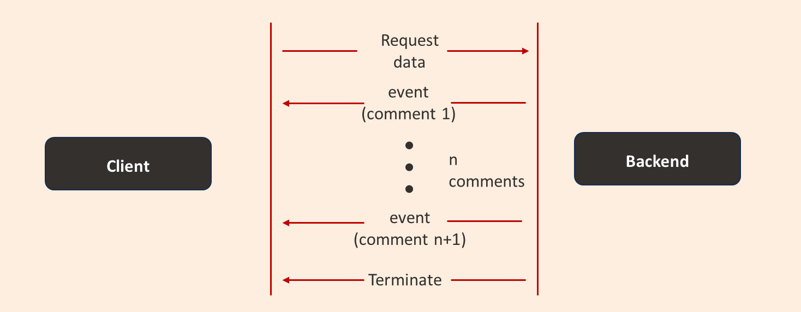

**Coping with success**

I joined a much-smaller-than-today’s Facebook in 2011 to work on what would eventually become the developer tools team. At the time I joined, the engineering team was in the hundreds and the tools we had for development were, well, not great. PHP was the backbone of almost everything, with millions of lines of code. JavaScript was secondary, and only a few critical services ran on other languages. The company was scaling rapidly, and our development practices weren’t keeping up.

As the codebase grew, so did the difficulty of maintaining and improving it.  Facebook became much more feature rich and simple enhancements became complicated and error prone.  Often new features needed to operate conditionally on how other preexisting features were already operating.  Essentially with each new layer of features teams added, state management became a greater concern.

{/* truncate */}

**Power of type systems**

Facebook’s codebase relied heavily on dynamic constructs called “gatekeepers” that determined which features were live for which users under different conditions. But these gatekeepers could change which code paths were executed in ways that weren’t always obvious during development.

The inability to recreate the state of a path made testing and refactoring a nightmare. Imagine this: you tweak a method, and three weeks later, you’re woken up at 3 AM because your change broke something deep in the application. Over time developers stopped touching critical parts of the codebase. Instead of refactoring and improving existing code, they’d build parallel versions—hacks on top of hacks. The technical debt was piling up, and we needed a way to make changes safely and confidently.

We believed we could use types to make deeper static analysis and automatic refactoring possible in the PHP language and this would help engineers bring some order to the chaos.  The system was called Hack. Adoption wasn’t immediate—there was some resistance—but over time, developers saw the value. We intentionally designed the type system to be more flexible than strictly “correct.” This decision allowed us to cover more of the codebase quickly, even if it meant making some trade-offs in precision. It worked. Hack became the default way to write PHP at Facebook, and it’s still in use today.

**Incrementality**

As Facebook applications grew denser and more layered, more teams were looking to add real-time features where users’ actions immediately impact others, like clicking a "Like" button and instantly updating the count across everyone’s apps.  Such features are essential because performance and interactivity grew user engagement. When an application feels fresh and interactive, it’s much more appealing than static content. However, implementing this in a scalable way is not straightforward.

A typical scenario: you fetch a Facebook post. Normally, the server retrieves data like the post’s text, the number of likes, and the comments. It applies rules to filter and prioritize what’s shown (e.g., highlighting the most relevant comments or enforcing privacy settings). This logic runs once and produces a static result—the post you see on your screen.

Making this "live" means the post updates automatically. If someone likes it, the count changes instantly. If a comment gets edited or deleted, it reflects for everyone in real time. Achieving this requires "inverting the arrow."  Traditionally, a user’s actions—like adding a comment— produces a write to the database. To make things reactive, engineers needed to turn these writes into continuous streams of updates. For example:

1\. **User likes a post** → Create a stream of updates for that post’s like count.
2\. **User adds a comment** → Create a stream for the comments section.

Typically reactive frameworks compose these streams into live updates. While conceptually straightforward, this approach fell short because:

**Excessive recomputations**: Each small change could require recalculating the entire post, which is expensive and inefficient.

**Caching problems**: To compute incrementally but avoid excessive fetching and recomputation, you need caches. But managing caches as objects are mutated becomes a nightmare—how do you ensure they’re up-to-date without introducing inconsistencies?

Caches can work well for "hot" data—frequently accessed data with a short lifespan. But outside this narrow use case, caching comes with trade-offs:

1\. **Long TTL (Time-to-Live)**: Keeps data in the cache longer, but risks showing stale or inconsistent data.
2\. **Manual Invalidation**: Requires custom logic to invalidate caches when data changes. This is extremely error-prone and hard to maintain.

For large-scale systems like Facebook, neither approach was sustainable. We needed a better solution.

We created Skiplang to better serve our needs for better state management and real-time features & services.  We believed we could use our experience developing type systems to flip the way we think about reactive systems. Instead of starting with database writes and building logic from there, Skiplang let you:

1\. **Define the Desired Output**: Begin with what you want to build (e.g. a Facebook post).
2\. **Use Declarative Rules**: Specify what data is needed and how it’s combined.

Skiplang was originally designed to handle incremental computation and caching, but its capabilities quickly expanded to address the needs of reactive features and efficient data handling.  We built Skiplang on the premise that **cached objects were immutable** \- unchangeable once created. If we could guarantee that immutability, it would be easier to use static analysis of Skiplang’s typed language to track dependencies and know exactly when to invalidate the cache and where to recompute.  Traditional programming languages didn’t give us the tools to enforce these guarantees.
