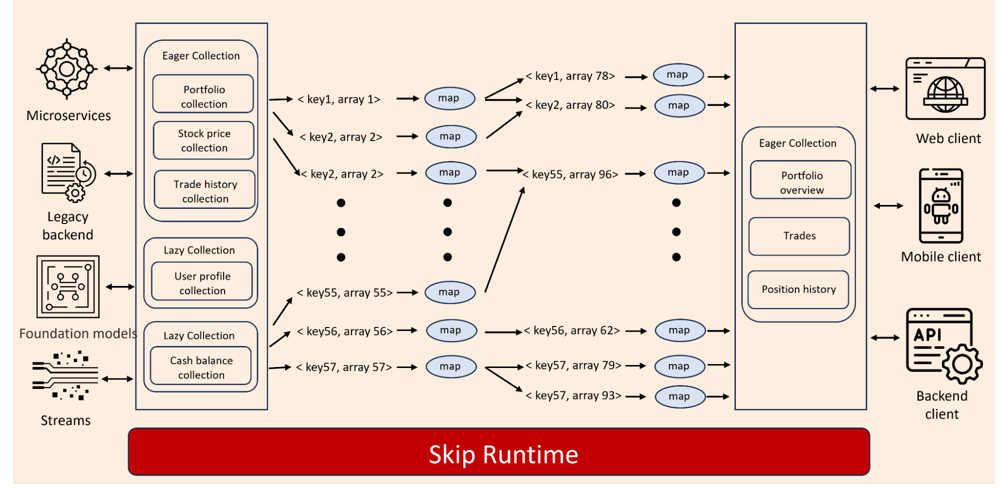
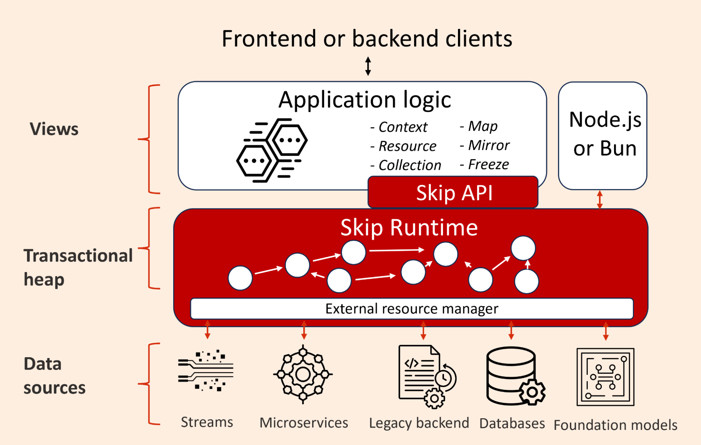

**Skip After Meta**

Facebook allowed us to open source both Hack and Skiplang so we could share both with the larger engineering community.  I eventually decided to leave Facebook (now Meta) to build on the work of Hack and Skiplang and develop technologies that would address the same challenges we had at Facebook but for engineers generally.  To do this, SkipLabs needed to incorporate two new technologies to make the work we did at Facebook usable in a normal engineering context.

{/* truncate */}

1. A way to manage objects transactionally as their state changes

This is an essential and unique design choice in Skip’s approach to incremental computation.  Without it, developers have to program against streams and assume a large and insidiously subtle amount of complexity.  Incremental computation will only become mainstream if the dev and ops time experience is simpler and easier than the more common request/response paradigm, not just faster & continuous.

Object handling needed to go beyond simple caching.  We needed an in-memory system of objects and collections that could maintain an up-to-date view of the data as it changed which we call \*\*reactive collections\*\*.

Most of the objects in a program can be managed with memoization: storing and reusing the results of expensive computations.  This can be fast, simple and efficient provided you know when to evict the memoized values.

In Skip, memoized objects are held in “Lazy Collections.” They compute and cache results only when needed clients and will automatically evict data from the cache to save memory.

Other objects serve as indices or dictionaries. These objects realistically cannot be memoized as every value in the dictionary needs to be up to date at all times.  Skip manages these objects as “Eager Collections,” keeping them in memory at all times and recomputing whenever a source updates.

2. An ability to program services that compute incrementally but in familiar languages.

Skiplang was built from the ground up to support incremental computing and it’s very well suited to that purpose.  Realistically engineering teams outside of Meta have already picked their languages and stacks and it would be unrealistic to expect everyone to change to meet Skip.

We realized we could bring the most essential characteristics of Skiplang to already widely used languages, starting with TypeScript.  Skip aims to allow developers to implement programs declaratively while the framework automatically manages the state and decides what parts of the graph of computation need to be re-run.  For this to work, programs need to be deterministic, effect free and assume they are interacting with objects in a transactional heap.

The Skip Runtime integrates with popular TypeScript runtimes (e.g. Node, Bun) and using proxy objects gives TypeScript a reactive, transactional heap.  We then added a TypeScript API that gives developers a simple programming model of map functions applied to the objects Skip is now holding in its transactional heap.  In this way, developers get to stick with their preferred language while Skip can transparently manage both the state of the objects and directs when different parts of a program are recomputed.

We added higher level features to the API to more easily manipulate those collections (filter, slice, join, etc ...), and added support for sub-collections (collections created while computing the entry of a collection), among other things.  In the future we think there’s an opportunity to add other (optional) higher level primitives to make building complex services even easier.

Today the Skip Framework exclusively supports TypeScript.  We plan to add support for Python and Java in the near future and other languages in the medium term.

**The Skip Framework**

By combining a programming model that enforced effect-free operations on immutable objects with a runtime that abstracted away state and data management details, Skip has grown from a language to a full framework that we’ve recently released.

**Why Skip is useful**

Skip can power services that perform any combination of reads and writes but the main benefits are experienced with reads.  Skip gives read-based features & functions several advantages over the more typical request/response model.

Skip programs will:

Continuously react to changes in data and clients \- by managing the state of objects and the impact of functions on those objects, Skip services can incrementally recompute and stream new values to clients without recomputing unchanged values unnecessarily.

Automatically manage their own state \- a feature may need to fetch data from multiple sources, compute intermediate results in a specific order while hydrating & invalidating different caches.  In Skip all of this complexity is handled by the framework.  Developers just write functions against collections for a single point in time.

Let you introspect their execution \- reactive programs are historically challenging to inspect and debug.  Because the Skip runtime manages both the objects and their graph of computation, Skip programs are very easy to introspect.  We plan to add a debugger to the framework to capitalize on this part of the design.

Work alongside traditional request / response programs \- Unlike past approaches to state management and reactivity, we wanted to make sure Skip was not an “all or nothing” engineering decision.  Vertically, Skip can run in one or several layers of an existing software stack. It can read and write data from preexisting REST services, streaming sources or some legacy backend.  Skip can also power a new service where it reads and writes from a traditional database.

Horizontally, Skip can power some or all the features of an application’s backend and coexists with other business logic written in other frameworks, languages, etc.  Within Skip’s context it's very easy to extend what you’ve implemented in a service through a feature called “mirroring” that lets a new service import and synchronize data from a pre-existing peer service.

**Why it feels awesome to use Skip**

Skip lets developers focus on the "what" instead of the "how." By defining the desired outcome declaratively, Skip generates the necessary logic to keep data live and reactive. It handles complexities like cache invalidation and recomputation efficiently without adding any cognitive burden for the developer.

We took a graph-based approach to the Skip programming model. You define your computation as a series of operations on collections, creating a \*\*graph of reactive computations\*\*. Each node in the graph can be a lazy or eager collection, and the framework automatically manages dependencies, updates, and cache invalidation for you.

Here’s the magic: You write your program as if \*\*time is frozen\*\*, defining static outputs in terms of static inputs.  Skip then turns this into a live, streaming system. If an input changes, the framework efficiently propagates updates to the affected parts of the graph, ensuring everything stays consistent. It even supports transactional updates, so you can modify multiple inputs simultaneously without breaking consistency.

This approach not only makes building incremental features easier but also scales better as the system grows. By focusing on what you want to build and letting Skip handle the rest, developers can deliver live, interactive features without the typical headaches.

**Why Skip matters**

Skip isn’t just about solving caching or problems of incremental computation, it’s about rethinking how we build systems that deal with constantly changing data. By giving developers tools to handle immutability, caching, and reactivity seamlessly, Skip makes it easier to write reliable, efficient, fast and scalable applications.

By combining the lessons learned from Facebook’s early challenges with the innovation of Skip, we’ve charted a path toward solving some of the most complex problems in real-time and reactive systems. This is just the beginning, and we’re excited to see where this journey takes us next.
